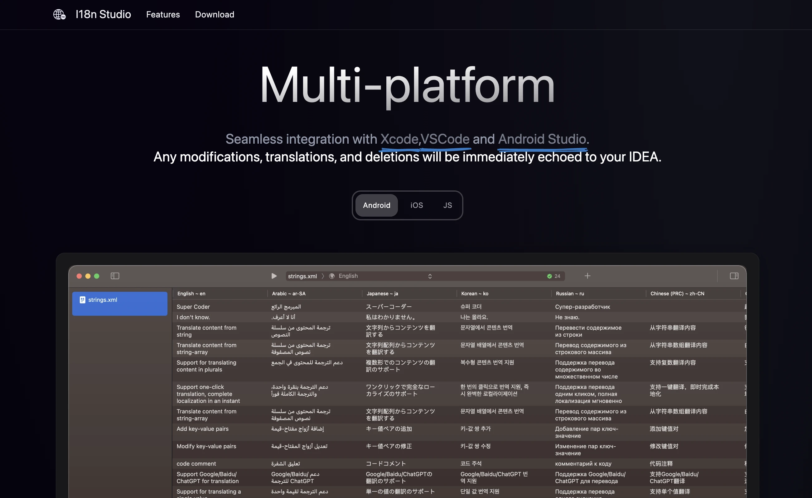
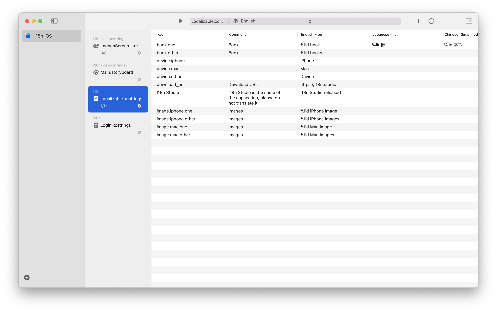
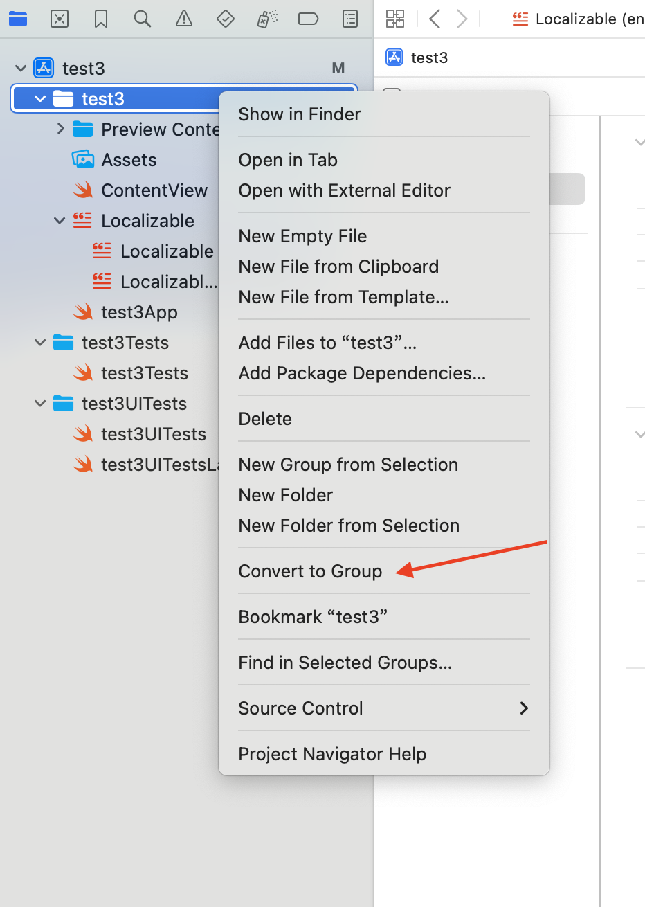
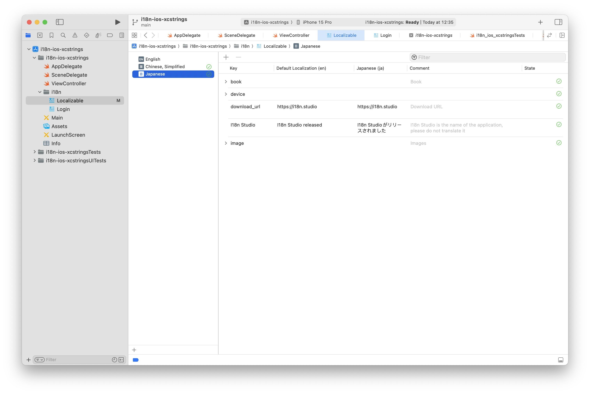

# i18n-ios-xcstrings

Sample project for translate .xcstrings files using I18n Studio.

## Introduction

This project introduces the use of I18n Studio to load, translate, modify, and delete data in .xcstrings files in Xcode15+.

**I18n Studio:**

A developer tool for easily completing i18n using GPT4.

For iOS, macOS, Android, and JS developers, translating multiple languages can be a painful task. However, I18n Studio makes this process incredibly simple. With just a click of a button, GPT4 can instantly complete the translation of multiple languages.

## Usage

**Requirement**:

* Download [I18n Studio](https://i18n.studio)
* Xcode15+
* macOS 14+
* Download this project

#### Load key-value pairs from .xcstrings files

1. Open I18n Studio
2. Click the button in the lower left corner to add a project and select the Xcode tab.
3. Enter the project name such as “I18n iOS”
4. Select the workspace of this project, for example `/Users/xxx/Desktop/i18n/Demo/i18n-ios-xcstrings`
5. Select the .xcodeproj directory, for example`/Users/xxx/Desktop/i18n/Demo/i18n-ios-xcstrings/i18n-ios-xcstrings.xcodeproj`

At this time, I18n Studio will load and display the .xcstrings file in the project.

**Xcode 16**

You may encounter the "Internationalization folder not found" error because Xcode 16 and above removed certain readable content from the project.pbxproj file. To fix this, right-click the root directory in Xcode, select "Convert to Group," and Then, follow the steps to "**Load key-value pairs from .xcstrings files**" to ensure it is read correctly.

#### Translate

Click the language selection button at the top of I18n Studio to select the source language of the project. When translating, you need to translate it into other languages. The default is English.

> Please ensure that the source language has data available for translation.

**1.Translate Value**

Translate individual key-value pairs

**2.Translate Key**

Click the button in the upper right corner to switch to GPT4.Then translate entire row of key-value pairs

> Batch translation must use GPT4, which is only available to subscribed users.

**3.Translate Language**

Translate into a language

**4.Translate All**

Click the Translate button at the top to translate the source language to all target languages.

Return to Xcode to view, you can see that all translation content has been echoed to Xcode.

**5.Add/remove languages**

1.Click the button in the upper right corner
2.Language:Click to check/uncheck to add/remove languages

**6.Delete key-value pairs**

Select a row and delete to delete the key-value pair of the entire row.
Multiple select rows, delete can delete multiple key-value pairs.

**7.Search**

cmd + f to search data

## Support

 If you have any questions or feedback,please feel free to contact us.

Email(Prefer): [baqiwl@gmail.com](mailto:baqiwl@gmail.com)

## License

MIT License © I18n Studio Team
